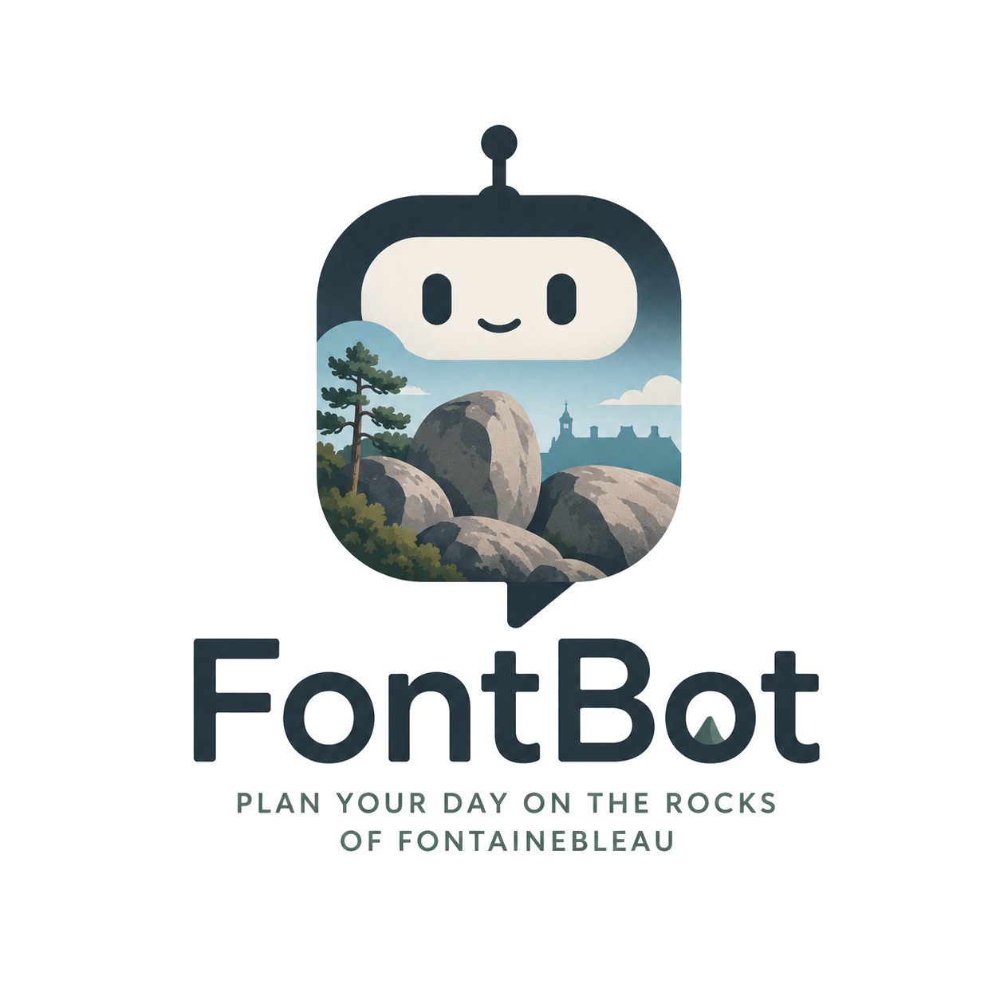

<div align="center">
  
  <p><em>Your Fontainebleau bouldering assistant — on the web.</em></p>
</div>

---

FontBot is an AI agent that helps you plan your day on the rocks of Fontainebleau. Ask it in natural language — *"find me a 6a circuit near Bas Cuvier with mostly slabs and no highballs"* — and it queries the [Boolder](https://www.boolder.com) app's database to come back with real areas, circuits and problems.

Under the hood it's a [Turborepo](https://turbo.build/repo) monorepo: a React + Vite frontend talks to an [Elysia](https://elysiajs.com) server running on [Bun](https://bun.sh), which drives a tool-calling LLM agent built with the [Vercel AI SDK](https://ai-sdk.dev).

## Features

- **Web-native chat** — a fast, modern chat UI built with React, Tailwind and shadcn/ui.
- **Natural-language queries over Boolder data** — sectors, circuits, problems, grades, characteristics (slab, overhang, highball, kid-friendly, …), popularity, and more.
- **Tool-calling agent** — the LLM decides when to hit the database, when to ask clarifying questions, and when to summarize results.
- **Streaming responses** — replies stream token-by-token from the Vercel AI SDK so long answers feel instant.
- **Background jobs** — long-running work is offloaded to BullMQ workers backed by Redis.
- **Containerized** — everything runs locally and in production via Docker.

## How it works

```
┌──────────────┐   HTTP/WS   ┌────────────────┐   tool calls   ┌────────────────┐
│  Web client  │ ──────────► │   FontBot API  │ ─────────────► │  Boolder DB    │
│  React+Vite  │             │  Elysia + AI   │                │   (SQLite)     │
│              │ ◄────────── │  SDK agent     │ ◄───────────── │                │
└──────────────┘  stream     └────────┬───────┘   results      └────────────────┘
                                      │
                                      ▼
                              ┌────────────────┐
                              │ BullMQ workers │
                              │     Redis      │
                              └────────────────┘
```

1. The React client sends a message to the Elysia API.
2. The server forwards it to a Vercel AI SDK agent wired up with **Boolder tools** (search areas, list circuits in a sector, filter problems by grade/style, etc.).
3. The agent reasons over the request, queries SQLite through Kysely, and streams the answer back.
4. Heavy or async work is enqueued on BullMQ and processed by a Redis-backed worker.

## Tech stack

### Language & tooling
- **Language**: [TypeScript 5](https://www.typescriptlang.org)
- **Runtime & package manager**: [Bun](https://bun.sh)
- **Monorepo**: [Turborepo](https://turbo.build/repo)
- **Containerization**: [Docker](https://www.docker.com)

### Frontend
- **Framework**: [React](https://react.dev) + [Vite](https://vitejs.dev)
- **Routing**: [TanStack Router](https://tanstack.com/router)
- **Data fetching**: [TanStack Query](https://tanstack.com/query)
- **State**: [Zustand](https://zustand-demo.pmnd.rs)
- **Styling**: [Tailwind CSS](https://tailwindcss.com)
- **Components**: [shadcn/ui](https://ui.shadcn.com)

### Backend
- **HTTP server**: [Elysia](https://elysiajs.com)
- **AI**: [Vercel AI SDK](https://ai-sdk.dev) for the agent + tool-calling loop
- **Validation**: [Zod](https://zod.dev)
- **Database**: [PostgreSQL](https://www.postgresql.org) via [Kysely](https://kysely.dev)
- **Cache & queues**: [Redis](https://redis.io) + [BullMQ](https://docs.bullmq.io)
- **Data**: [Boolder](https://www.boolder.com) bouldering database

## Repository layout

```
.
├── apps/
│   └── backend/         # Elysia API + AI agent
│   │   └── boolder-data/ # Boolder data (SQLite)
│   └── frontend/        # React + Vite frontend           
└── packages/
    ├── eslint-config/
    └── typescript-config/
```

## Example prompts

- *"I have 4 hours tomorrow afternoon, want to climb 5+ to 6b, prefer slabs. Where should I go?"*
- *"List the kid-friendly circuits in Apremont."*
- *"What's the easiest yellow circuit close to Bas Cuvier?"*
- *"Suggest a warm-up sector for a rainy-but-drying day."*

## Roadmap

- [x] Natural language search
- [x] Web frontend (React + Vite + shadcn)
- [ ] Problems geo-location (on map, directions)
- [ ] Photo replies for selected problems
- [x] Weather + rock-drying awareness

## Acknowledgements

FontBot is **not affiliated with Boolder** — huge thanks to the Boolder team for building and openly sharing the best bouldering app for Fontainebleau. Go support them: [boolder.com](https://www.boolder.com).
